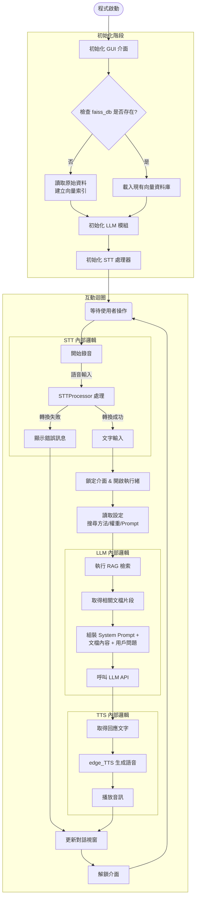

```mermaid
flowchart TD
    Start([程式啟動]) --> InitUI[初始化 GUI 介面]
    
    %% 初始化階段
    subgraph Initialization [初始化階段]
        InitUI --> CheckDB{檢查 faiss_db 是否存在?}
        CheckDB -- 否 --> CreateDB[讀取原始資料<br/>建立向量索引]
        CheckDB -- 是 --> LoadDB[載入現有向量資料庫]
        CreateDB --> InitLLM[初始化 LLM 模組]
        LoadDB --> InitLLM
        InitLLM --> InitSTT[初始化 STT 處理器]
    end

    InitSTT --> WaitLoop(等待使用者操作)

    %% 使用者互動
    subgraph Interaction [互動迴圈]
        WaitLoop --> VoiceInput
        %% 語音路徑
        subgraph STT_Logic [STT 內部邏輯]
            VoiceInput[開始錄音] --> |語音輸入|ProcessVoice[STTProcessor 處理]
            ProcessVoice -->|轉換失敗| ShowError[顯示錯誤訊息]
            ProcessVoice -->|轉換成功| FillText[文字輸入]
        end
        ShowError --> UpdateUI
        FillText --> LockUI[鎖定介面 & 開啟執行緒]
        LockUI --> GetSettings
        
        %% RAG 處理
        GetSettings[讀取設定<br/>搜尋方法/權重/Prompt]
        GetSettings --> RAG_Search[執行 RAG 檢索]
        
        subgraph LLM_Logic [LLM 內部邏輯]
            RAG_Search --> GetChunks[取得相關文檔片段]
            GetChunks --> BuildPrompt[組裝 System Prompt +<br/>文檔內容 + 用戶問題]
            BuildPrompt --> CallAPI[呼叫 LLM API]
        end

        CallAPI --> GetResponse[取得回應文字]

        subgraph TTS_Logic [TTS 內部邏輯]
            GetResponse --> TTS_Gen[edge_TTS 生成語音]
            TTS_Gen --> PlayAudio[播放音訊]
        end

        PlayAudio --> UpdateUI[更新對話視窗]
        UpdateUI --> UnlockUI[解鎖介面]
        UnlockUI --> WaitLoop
    end
```

